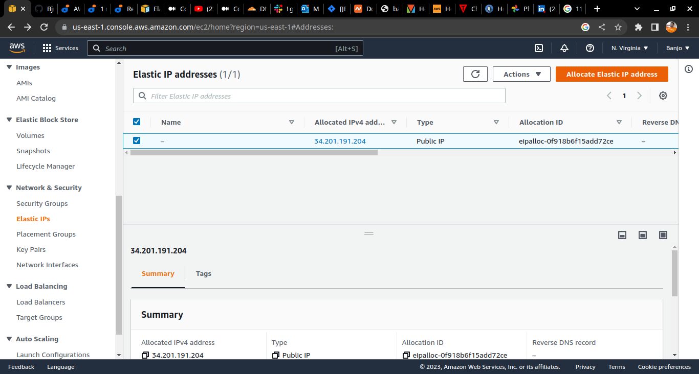
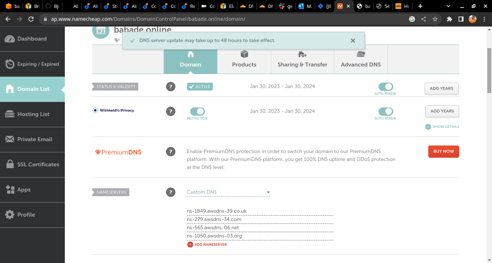

#### This project intends to diversify my knowledge o Load Balancing Techniques using NGINX webserver, a consolidtaion on the existing knowledge of the use of Apache for Load Balancing
#### Project10 of Banjo Babade at darey.io 

setting 443(HTTPS) protocol  inbound security rules on the instace to bounce MIMT attacks (Man In the Middle Attacks)

installing nginx

editing nginx.conf file sudo vi /etc/nginx/nginx.conf

installing and configuring certbot on nginx 

#### At this point I used namecheap.com to register babade.online thus the congiguration steps was found on https://aws.plainenglish.io/how-to-point-namecheap-domain-to-aws-ec2-instance-8b0544cc2c88 

Creating elasttic IP

using Route 53 service on aws

https://medium.com/progress-on-ios-development/connecting-an-ec2-instance-with-a-godaddy-domain-e74ff190c233 this article is frp Godaddy.com user

Name servers generated successfully from Route 53 using the Elastic IP 

Using the Elastic IP for configuration on Rout 53

copied the generated name servers to my DNSserver address in Namecheap

Certbot configured on babade.online

Certbot configured on babade.online

Certbot configured on babade.online successfully

certificate screenshot

crontab configuration

Load balancing and HTTPS(443 protocol)  achieved successfully

Devop Journey , a very Interesting one Indeed...................

